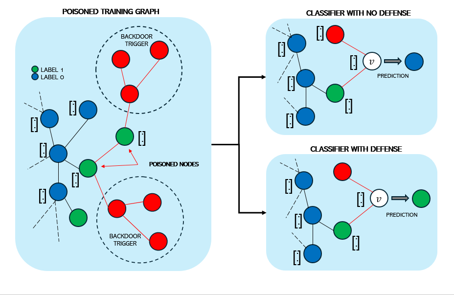
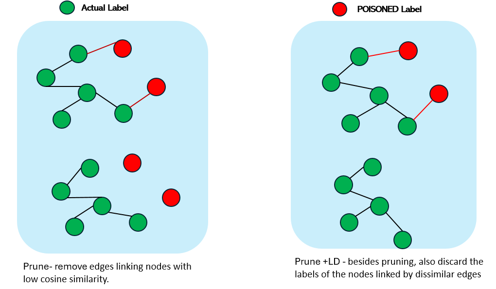
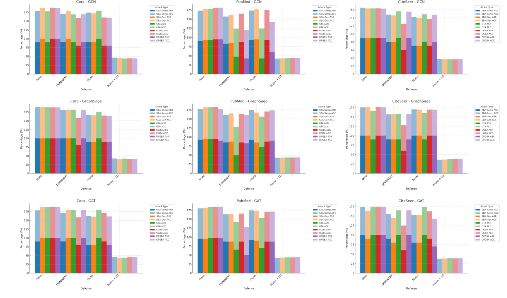
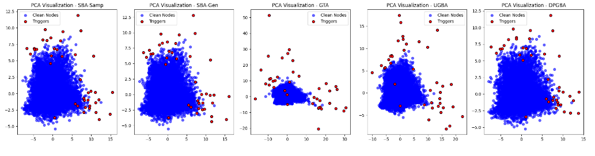

# The Power of Many: Investigating Defense Mechanisms for Resilient Graph Neural Networks

## Overview

This project explores backdoor attacks on GNNs and the effectiveness of several defense strategies. Different GNN architectures are used alongside various attack methods, including **SBA-Samp**, **SBA-Gen**, **GTA**, **UGBA**, and **DPGBA**. The implemented defenses include **Dominant Set Outlier Detection**, **Prune**, and **Prune + LD (Label Discard)**. This is the implementation of this paper [The Power of Many: Investigating Defense Mechanisms for Resilient Graph Neural Networks](https://ieeexplore.ieee.org/document/10825720)


<p align="center">
  
</p>

# Project Directory Structure

    
    /
    ├── data/                     # Directory for storing dataset files
    │   └── load_data.py          # Dataset loading and preprocessing
    ├── gnn_models/               # Directory for GNN models
    │   ├── gcn.py                # GCN model definition
    │   ├── graph_sage.py         # GraphSAGE model definition
    │   ├── gat.py                # GAT model definition
    │   └── trigger_generator.py  # Trigger generator model
    ├── attacks/                  # Directory for all attack methods
    │   ├── sba_samp.py           # SBA-Samp attack
    │   ├── sba_gen.py            # SBA-Gen attack
    │   ├── gta.py                # GTA attack
    │   ├── ugba.py               # UGBA attack
    │   └── dpgba.py              # DPGBA attack
    ├── defenses/                 # Directory for defense mechanisms
    │   ├── prune.py              # Prune edge defense
    │   ├── prune_and_discard.py  # Prune + LD defense
    │   └── ood_detector.py       # Out-of-distribution detector
    ├── clustering/               # Dominant set clustering method
    │   └── dominant_set_clustering.py
    ├── utils/                    # Utility functions
    │   ├── seed.py               # Set seed for reproducibility
    │   ├── metrics.py            # Compute metrics for ASR and clean accuracy
    │   └── visualize.py          # Visualization functions
    ├── config.py                 # Configuration settings and constants
    ├── main.py                   # Main script to run the experiments
    ├── Prune.png
    ├── Results.png
    ├── backdoor_attack_results_summary.csv
    ├── graph_backdoor.png
    └── README.md                 # Project description and usage instructions


This structure provides a high-level view of the project organization, including directories for data, models, attacks, defenses, clustering methods, utility functions, and configuration and execution files.


## Datasets

We used three widely used citation network datasets for the experiments:

**Table 1: Summary of Datasets Used in Experiments**

| Dataset | Nodes  | Classes | Edges | Feature Dimension |
|---------|--------|---------|-------|-------------------|
| Cora    | 2,708  | 7       | 5,429 | 1,433            |
| CiteSeer| 3,327  | 6       | 4,732 | 3,703            |
| PubMed  | 19,717 | 3       | 44,338| 500              |


## Attack Strategies

The following backdoor attack strategies were implemented:

- **SBA-Samp**: Subgraph-based Backdoor Attack with Sampling
- **SBA-Gen**: Subgraph-based Backdoor Attack with Generated Triggers
- **GTA**: Graph Trojan Attack
- **UGBA**: Unnoticeable Graph Backdoor Attack
- **DPGBA**: Distribution-Preserving Graph Backdoor Attack

Each attack method has unique characteristics that aim to make the backdoor trigger either more effective or less detectable.

## Defense Mechanisms

### 1. Dominant Set Outlier Detection (DSOD)

This method detects and removes outliers in the feature space to reduce the influence of poisoned nodes.

### 2. Prune

Prunes edges that link nodes with low cosine similarity, removing connections that may carry attack features.

### 3. Prune + LD (Label Discard)

Combines pruning with label discarding for nodes connected by pruned edges. This helps in removing poisoned nodes with higher confidence.

<p align="center">
  
</p>

## Experimental Results

The following tables summarize the results for each GNN model (GCN, GraphSage, GAT) under different attack and defense configurations. Metrics include **Attack Success Rate (ASR)** and **Clean Accuracy (ACC)**.

Here's the updated tables with the stars removed from all values except the zeros:

---

### Results for GCN Model

| Dataset | Defense                     | SBA-Samp ASR | SBA-Samp ACC | SBA-Gen ASR | SBA-Gen ACC | GTA ASR | GTA ACC | UGBA ASR | UGBA ACC | DPGBA ASR | DPGBA ACC |
|---------|------------------------------|--------------|--------------|-------------|-------------|---------|---------|----------|----------|-----------|-----------|
| Cora    | None                         | 90           | 88.54        | 100         | 87.43       | 90      | 87.43   | 100      | 87.80    | 100       | 87.62     |
| Cora    | Dominant Set Outlier Detection| 90          | 79.30        | 100         | 78.00       | 90      | 78.74   | 80       | 78.37    | 90        | 79.11     |
| Cora    | Prune                        | 90           | 83.92        | 90          | 81.70       | 100     | 79.30   | 80       | 79.85    | 80        | 79.11     |
| Cora    | Prune + LD                   | **0**        | 46.40        | **0**       | 44.92       | **0**   | 43.99   | **0**    | 44.55    | **0**     | 44.18     |
| PubMed  | None                         | 90           | 83.39        | 92.5        | 85.39       | 92.5    | 86.03   | 95       | 86.46    | 95        | 86.63     |
| PubMed  | Dominant Set Outlier Detection| 82.5        | 74.87        | 85          | 76.62       | 47.5    | 76.77   | 87.5     | 77.76    | 42.5      | 77.38     |
| PubMed  | Prune                        | 92.5         | 81.44        | 95          | 82.04       | 42.5    | 82.15   | 92.5     | 82.65    | 60        | 82.73     |
| PubMed  | Prune + LD                   | **0**        | 42.43        | **0**       | 42.78       | **0**   | 42.96   | **0**    | 43.19    | **0**     | 43.52     |
| CiteSeer| None                         | 90           | 75.19        | 90          | 73.38       | 90      | 73.38   | 90       | 73.53    | 90        | 72.78     |
| CiteSeer| Dominant Set Outlier Detection| 80          | 67.82        | 80          | 65.86       | 90      | 66.17   | 60       | 64.81    | 90        | 65.26     |
| CiteSeer| Prune                        | 70           | 72.33        | 70          | 69.62       | 80      | 68.72   | 70       | 67.37    | 80        | 67.22     |
| CiteSeer| Prune + LD                   | **0**        | 37.44        | **0**       | 36.84       | **0**   | 37.14   | **0**    | 36.69    | **0**     | 37.74     |

---

### Results for GraphSage Model

| Dataset | Defense                     | SBA-Samp ASR | SBA-Samp ACC | SBA-Gen ASR | SBA-Gen ACC | GTA ASR | GTA ACC | UGBA ASR | UGBA ACC | DPGBA ASR | DPGBA ACC |
|---------|------------------------------|--------------|--------------|-------------|-------------|---------|---------|----------|----------|-----------|-----------|
| Cora    | None                         | 100          | 89.28        | 100         | 88.91       | 100     | 88.72   | 100      | 88.17    | 100       | 88.17     |
| Cora    | Dominant Set Outlier Detection| 100         | 80.78        | 100         | 81.33       | 100     | 81.52   | 80       | 78.93    | 100       | 80.78     |
| Cora    | Prune                        | 90           | 77.08        | 90          | 75.60       | 100     | 75.42   | 90       | 74.86    | 90        | 74.12     |
| Cora    | Prune + LD                   | **0**        | 42.33        | **0**       | 41.22       | **0**   | 42.14   | **0**    | 40.85    | **0**     | 40.85     |
| PubMed  | None                         | 92.5         | 84.28        | 95          | 86.61       | 95      | 87.22   | 95       | 87.65    | 90        | 87.90     |
| PubMed  | Dominant Set Outlier Detection| 85          | 75.30        | 87.5        | 77.33       | 50      | 77.94   | 85       | 78.47    | 82.5      | 78.42     |
| PubMed  | Prune                        | 92.5         | 82.17        | 85          | 82.32       | 72.5    | 83.64   | 87.5     | 83.19    | 90        | 83.44     |
| PubMed  | Prune + LD                   | **0**        | 43.06        | **0**       | 43.24       | **0**   | 43.90   | **0**    | 43.65    | **0**     | 44.15     |
| CiteSeer| None                         | 100          | 75.34        | 100         | 75.79       | 90      | 76.09   | 100      | 76.09    | 100       | 75.64     |
| CiteSeer| Dominant Set Outlier Detection| 90          | 66.62        | 90          | 67.07       | 90      | 67.97   | 60       | 68.12    | 90        | 67.22     |
| CiteSeer| Prune                        | 100          | 70.08        | 100         | 69.17       | 90      | 69.77   | 100      | 69.17    | 100       | 69.02     |
| CiteSeer| Prune + LD                   | **0**        | 36.24        | **0**       | 36.84       | **0**   | 38.20   | **0**    | 38.20    | **0**     | 38.35     |

---

### Results for GAT Model

| Dataset | Defense                     | SBA-Samp ASR | SBA-Samp ACC | SBA-Gen ASR | SBA-Gen ACC | GTA ASR | GTA ACC | UGBA ASR | UGBA ACC | DPGBA ASR | DPGBA ACC |
|---------|------------------------------|--------------|--------------|-------------|-------------|---------|---------|----------|----------|-----------|-----------|
| Cora    | None                         | 90           | 88.54        | 100         | 87.43       | 100     | 87.43   | 100      | 88.72    | 100       | 88.54     |
| Cora    | Dominant Set Outlier Detection| 90          | 80.41        | 100         | 80.22       | 100     | 79.11   | 80       | 78.56    | 100       | 79.48     |
| Cora    | Prune                        | 80           | 82.62        | 80          | 80.22       | 100     | 80.04   | 90       | 81.15    | 80        | 81.33     |
| Cora    | Prune + LD                   | **0**        | 45.29        | **0**       | 43.44       | **0**   | 43.81   | **0**    | 45.84    | **0**     | 46.03     |
| PubMed  | None                         | 95           | 85.27        | 95          | 86.66       | 97.5    | 86.96   | 97.5     | 87.07    | 97.5      | 87.09     |
| PubMed  | Dominant Set Outlier Detection| 87.5        | 74.60        | 87.5        | 77.45       | 65      | 77.07   | 87.5     | 77.96    | 50        | 77.61     |
| PubMed  | Prune                        | 92.5         | 82.02        | 90          | 82.48       | 70      | 83.03   | 87.5     | 83.19    | 87.5      | 83.77     |
| PubMed  | Prune + LD                   | **0**        | 42.81        | **0**       | 43.17       | **0**   | 43.62   | **0**    | 43.49    | **0**     | 43.98     |
| CiteSeer| None                         | 100          | 73.68        | 90          | 73.68       | 100     | 74.14   | 100      | 74.14    | 100       | 74.14     |
| CiteSeer| Dominant Set Outlier Detection| 90          | 64.96        | 80          | 65.11       | 100     | 64.96   | 60       | 64.66    | 100       | 65.11     |
| CiteSeer| Prune                        | 80           | 72.78        | 80          | 72.48       | 100     | 73.53   | 90       | 72.03    | 70        | 72.63     |
| CiteSeer| Prune + LD                   | **0**        | 37.74        | **0**       | 38.20       | **0**   | 39.40   | **0**    | 38.65    | **0**     | 39.10     |


## Visualization of Results

### Attack Success Rate and Clean Accuracy by Defense Strategy

<p align="center">
  
</p>

### PCA Visualizations of Attacks

PCA visualizations show the separation between clean nodes and nodes with backdoor triggers.

<p align="center">
  
</p>

## How to Use

1. **Install dependencies**:
   ```bash
   pip install torch torch-geometric matplotlib scikit-learn networkx pandas
2. **Run experiments**:
   Run the main experiment script to test all attack and defense combinations.
    ```bash
    python main.py
3. **Check results**: 
Results are saved as a CSV file backdoor_attack_results_summary.csv.

## ⭐ Give a Star!

If you found this project useful or interesting, please consider giving it a star on GitHub!

## Use this bibtex to cite

 ```bibtex
    @INPROCEEDINGS{10825720,
      author={Dhali, Abhijeet and Dividino, Renata},
      booktitle={2024 IEEE International Conference on Big Data (BigData)}, 
      title={The Power of Many: Investigating Defense Mechanisms for Resilient Graph Neural Networks}, 
      year={2024},
      volume={},
      number={},
      pages={3572-3578},
      keywords={Training data;Finance;Entertainment industry;Medical services;Big Data;Graph neural networks;Security;Reliability;Protection;Anomaly detection;Graph Neural Networks (GNNs);Backdoor attacks;Data     poisoning;Security vulnerabilities;Defense mechanisms},
      doi={10.1109/BigData62323.2024.10825720}}
```

## References

1. Z. Zhang, J. Jia, B. Wang, and N. Z. Gong, “Backdoor attacks to graph neural networks,” in *Proceedings of the 26th ACM Symposium on Access Control Models and Technologies*, ser. SACMAT ’21. New York, NY, USA: Association for Computing Machinery, 2021, p. 15–26. [Online]. Available: [https://doi.org/10.1145/3450569.3463560](https://doi.org/10.1145/3450569.3463560)

2. Z. Xi, R. Pang, S. Ji, and T. Wang, “Graph backdoor,” in *30th USENIX Security Symposium (USENIX Security 21)*. USENIX Association, Aug. 2021, pp. 1523–1540. [Online]. Available: [https://www.usenix.org/conference/usenixsecurity21/presentation/xi](https://www.usenix.org/conference/usenixsecurity21/presentation/xi)

3. E. Dai, M. Lin, X. Zhang, and S. Wang, “Unnoticeable backdoor attacks on graph neural networks,” in *Proceedings of the ACM Web Conference 2023*, 2023, pp. 2263–2273. [Online]. Available:[https://dl.acm.org/doi/10.1145/3543507.3583392](https://dl.acm.org/doi/10.1145/3543507.3583392)

4. Z. Zhang, M. Lin, E. Dai, and S. Wang, “Rethinking graph backdoor attacks: A distribution-preserving perspective,” in *Proceedings of the 30th ACM SIGKDD Conference on Knowledge Discovery and Data Mining*, ser. KDD ’24. New York, NY, USA: Association for Computing Machinery, 2024, p. 4386–4397. [Online]. Available: [https://doi.org/10.1145/3637528.3671910](https://doi.org/10.1145/3637528.3671910)

5. E. Mequanint, Y. Tadesse, D. Melkamu, A. Negash, and Y. Tadesse, “Simultaneous clustering and outlier detection using dominant sets,” in *2016 15th IEEE International Conference on Machine Learning and Applications (ICMLA)*. IEEE, 2017, pp. 281–288. [Online]. Available: [https://ieeexplore.ieee.org/document/7899983](https://ieeexplore.ieee.org/document/7899983)


